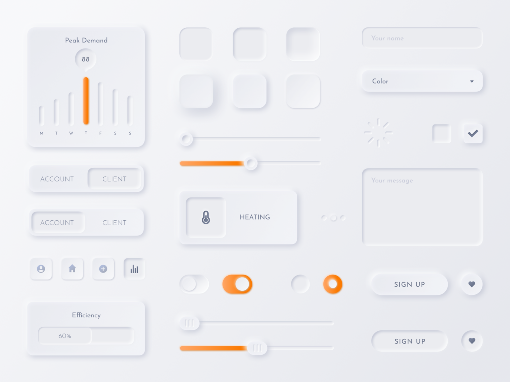
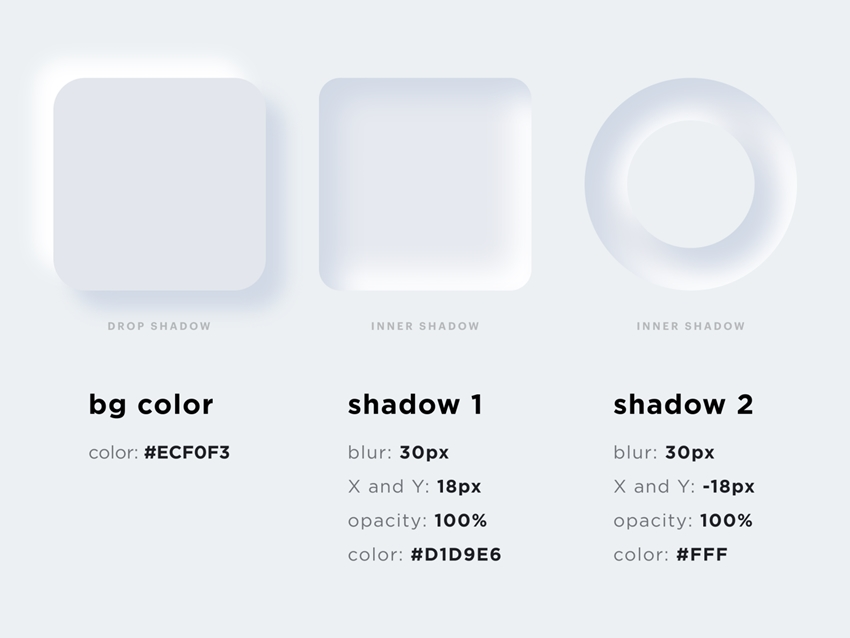
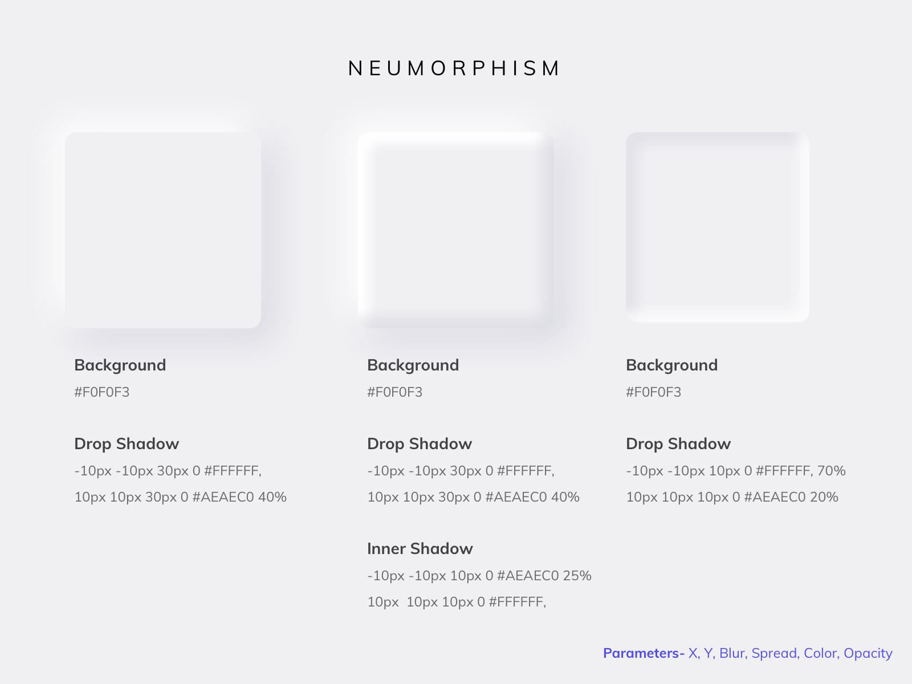
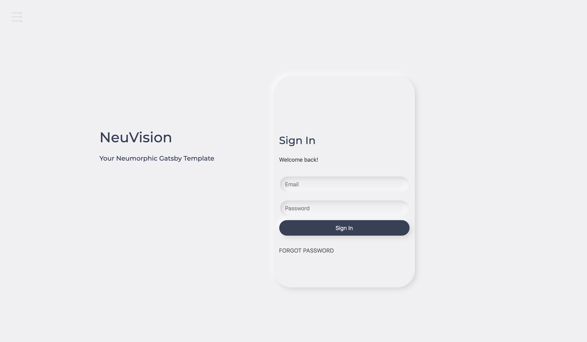

I remember the first time I saw neumorphic design. I thought it was so cool looking. I just had to learn how to do it.

Lately, I've been on a quest to learn how to use it and, in the process, I created a Neumorphic Gatsby Starter Template, free for you to use.

## What is Neumorphic Design?

It's the latest trend in UI design. The name comes from combining New + Skeuomorphism = Neumorphism and it’s a style that relies heavily on using shadows to achieve an almost floating-like effect on the elements in your website or mobile application. Neumorphic design is also known as soft design.

## What is Skeuomorphic Design?

Skeuomorphic design is a term used in graphical user interface (GUI) design to describe interface objects that closely resemble their real-world counterparts by how they appear or how the user can interact with them. A good example is the recycle bin icon. Yep, that icon you drag your unwanted files to when it's time to get rid of them. Skeuomorphic design brings familiarity to interface objects by using concepts users recognize.

## Neumorphic Design Examples


_A Neumorphic Design example by [Samson Vowles](https://dribbble.com/vowles)._




_Examples of Neumorphic design with their stylings._

Some of the shapes look raised, some lifted, and so on. Take note of the stylings mentioned in the images. Don't be afraid to play around with the box shadows.

Personally, I've found my winning `box-shadow` to be:

```javascript
box-shadow: rgb(213, 210, 208) 5px 5px 15px, rgb(255, 255, 255) -5px -5px 15px;
```

For me, this is the right balance of light and shadow, but that's my opinion. Find out what looks good to you.

## Any Design Suggestions?

### Less Is More

Use neumorphic design sparingly to highlight specific UI elements. It’s easy to get carried away and the next thing you know your screen is swamped with gradients and shadows. Draw attention to the hierarchy of a screen rather than adding the effect to every component.

### It's All About the Color

Neumorphism is all about the color of the entire screen, and delivering an entirely unique experience for users. When deciding on a color to use, you'll need to choose a color that compliments the shadows on the neumorphic design. My suggestion? Just play with the colors and see what you like. See what looks good to you.

### Don't Be Afraid to Play With the Shadows

If you think a shadow doesn't look like how you want it to, adjust it. Try to have it match your expectations. Just because the shadow looks good on one element doesn't mean it will look good on all elements. Play around with the shading and see what you like. Then make it into a component and re-use it throughout your project.

### Shapes

Easily accessible shapes are used and re-used where necessary to create an overly repetitive interface.

## Neumorphic Design Resources

A good resource is [neumorphism.io](https://neumorphism.io/). Here you can play with your color choices, making sure you choose the best color to compliment your neumorphic design shadows, and you can see how neumorphic design looks on different shapes. Main points: Explore and have fun!

### Adobe XD

Adobe XD is designer software from Adobe. It describes itself as "the all-in-one UX/UI solution for designing websites, mobile apps, and more. Design, prototype, share. All in XD." This includes neumorphic designs. I designed the blog thumbnail image in Adobe XD.

### Sketch

Sketch is a vector graphics editor for MacOS. Sketch is very popular with designers and has been built with a robust and developed plugin history, and a wider range of services.

### Others

Invision Studio (good for prototyping), Affinity Designer, and others could also get the job done. You just have to see what you like.

## Neumorphic Design Template (NeuVision)

To get you started on your Neumorphic UI website, here is a good starting point.



To see a live demo, click [here](https://hungry-elion-3babd3.netlify.app/).

To access the NeuVision template: [https://github.com/turq84/NeuVision-Gatsby-Template](https://github.com/turq84/NeuVision-Gatsby-Template)

The NeuVision Gatsby template is **free to use**. You can use the existing design elements to work on your website.

The currently existing elements are:

- Landing page
- Company feature section
- Login
- Newsletter
- The blog page, containing all blog posts
- Blog detail view

### Can I Contribute to the NeuVision Template?

Absolutely! Feel free to make improvements and send a pull request.

## Summary

In this post, you found out what neumorphic design was, examples of neumorphic designs, design resources, and you were introduced to the Neumorphic Gatsby Starter Template, [NeuVision](https://github.com/turq84/NeuVision-Gatsby-Template).

Neumorphic design is an emerging style and an opportunity for exploration. I see a lot of potential with this style. Go wild with it and have fun.
